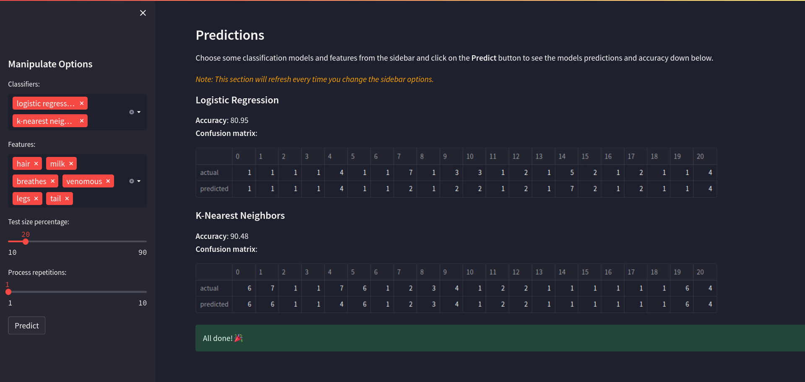

## Recognition Animals by Physical Traits

These days, animals traits are more important than ever for me, so I decided to create a simple app to help me recognize them more easily — and this is my first data science project.


### Dataset

The original dataset provided by the [UCI machine learning repository](https://archive.ics.uci.edu/ml/datasets/zoo). The zoo dataset contains the following information:

- **Animal name**: Unique for each instance
- **Hair**: Boolean
- **Feathers**: Boolean
- **Eggs**: Boolean
- **Milk**: Boolean
- **Airborne**: Boolean
- **Aquatic**: Boolean
- **Predator**: Boolean
- **Toothed**: Boolean
- **Backbone**: Boolean
- **Breathes**: Boolean
- **Venomous**: Boolean
- **Fins**: Boolean
- **Legs**: Numeric (set of values between 0, 2, 4, 6, 8)
- **Tail**: Boolean
- **Domestic**: Boolean
- **Catsize**: Boolean
- **Type**: Numeric (an integer in range 1-7)

### Screenshots




### Usage

Install the dependencies:

```bash
pip install -r requirements.txt
```

Run the app:

```bash
streamlit run app.py
```

### License

This project is licensed under the MIT license found in the [LICENSE](LICENSE) file in the root directory of this repository.
